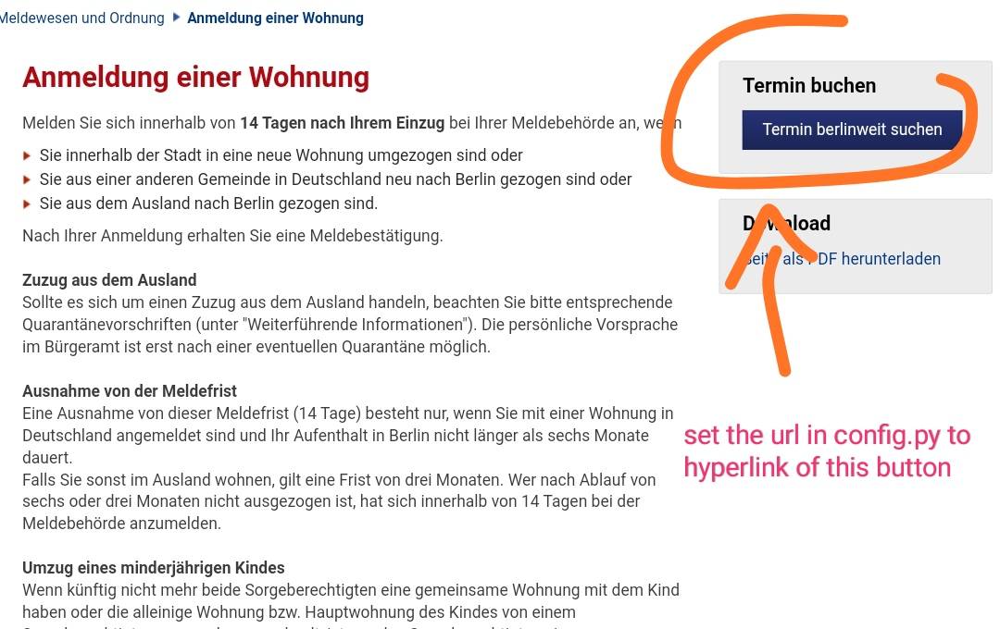
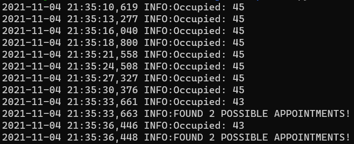

# Berlin Bürgeramt Appointment searcher
## Installation
- Install Python and pip (python package manager)
- (optional): Create virtualenvironment
- Install packages using `pip install -r requirements.txt`
### Configuration
- Make configuration in config.py
- Set url to the link you get when clicking "Termin Berlinweit suchen"
- (optional) set timeout
#### Hint
You must enter the URL of the button shown in following picture in `config.py`
(Variable `url`).
*The URL is very long.*

## Running
To run, execute `python main.py`. The Appointments are searched - number of free appointments will be printed in console
(See screenshot below)
# Disclaimer
This is for educational purposes only.

# Screenshot

