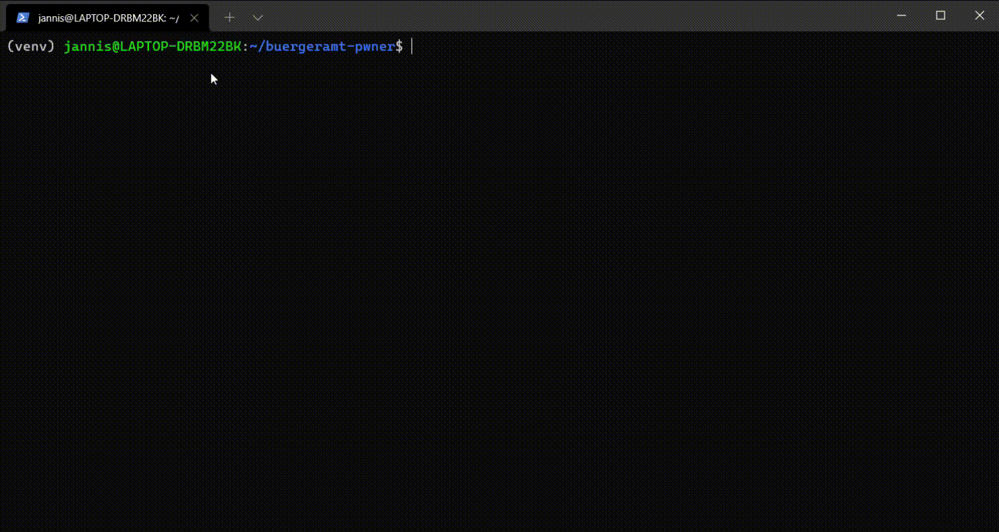

# Berlin Bürgeramt Appointment searcher
## Quickstart

## Notes
In the Quickstart Video, the site is not refreshed very often. This is due to heavy load on Berlin servers.
## Why should I use this?
After testing several libraries on GitHub,
I decided to write my own, very simple bot.
The other bots found on GitHub are heavily
over engineered and often don't contain any
dependency list (dependencies have to be installed
manually).
You can easily extend this library with your own code
(Put into `main.py`, `handle_found_appointments(int)`.
That's it.
- 36 lines of code only (no over engineering)
- python
- easily extendible
- contains requirements.txt
- v1.1: when jobs are found, the default Bell sound is printed (via print("\a")) (\a --> Character for playing terminal bell sound), so you can focus on your work/gaming/etc.
## Installation
- Install Python and pip (python package manager)
- (optional): Create virtualenvironment
- Install packages using `pip install -r requirements.txt`
### Configuration
- Make configuration in config.py
- Set url to the link you get when clicking "Termin Berlinweit suchen"
- (optional) set timeout
#### Hint
You must enter the URL of the button shown in following picture in `config.py`
(Variable `url`).
*The URL is very long.*

## Running
To run, execute `python main.py`. The Appointments are searched - number of free appointments will be printed in console
(See screenshot below)
# Disclaimer
This is for educational purposes only.

# Screenshot

# Possible Extensions
- Play a sound, when appointments are found
- Send a message over telegram bot, when appointments are found
